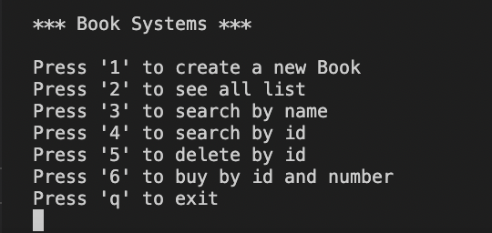

# Week 3 | Homework
This work is the third week of the [Picus Security](https://www.picussecurity.com) Golang Backend Web Development Bootcamp
* It has added to getting book list feature
* It has added to searching by book name feature
* It has added to returning by book id feature
* It has added to deleting by book id feature
* It has added to buying by book id and number of book feature
* It has added to usage feature

I have written Medium article about the [Understanding Concurrency](https://medium.com/@kayahuseyin/understanding-concurrency-b79f928aaf76)

## Installation
```bash
git clone https://github.com/Picus-Security-Golang-Bootcamp/homework-2-week-3-hkaya15.git
```

## Usage

### List Command
```go
// It returns book list

go run main.go list
```

### Search Command 
```go
// ıt returns the book that searched by book name

go run main.go search <bookName>
go run main.go search Lord of the Ring: The Return of the King
```

### Get Command
```go
// It returns the book that got by book id

go run main.go get <bookID>
go run main.go get -id 5
```

### Delete Command
```go
// It returns the book that deleted by book id and new book list

go run main.go delete <bookID>
go run main.go delete -id 5
```

### Buy Command
```go
// It returns the book that bought by book id and quantity

go run main.go buy <bookID> <quantity>
go run main.go buy -bookID 2 -quantity 10
```

***
## UI (Optional)
There is basic UI(It's optional)


***

## License
[MIT](https://mit-license.org)
